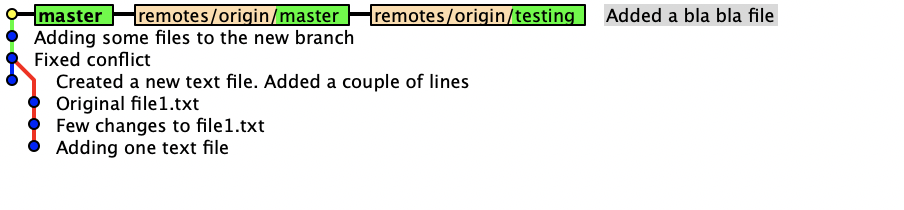
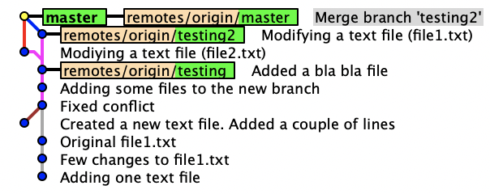

Git - Exercise 1
===

1.  Install git in your (Linux) system and set your username and e-mail.

    ``` {breaklines=""}
    $ sudo apt install git 'installing git'
    $ git config --global user.name lgotarra 'setting up my username, which matches with my Github user'
    $ git config --global user.email 97gotarra@gmail.com 'setting up my mail. This also matches my Github
    account'
    ```

2.  In your system, create a bare repository called `myrepo.git`.

    ``` {breaklines=""}
    $ mkdir myrepo.git 'create the repo directory'
    $ cd myrepo.git 'move into the repo directory'
    /myrepo.git/$ git init --bare 'init a bare repo'
    ```

3.  In your system, create two clones of myrepo called `wc1` and `wc2`.

    ``` {breaklines=""}
    /myrepo.git/$ cd .. 'move to the previous directory'
    $ git clone myrepo.git/ wc1 'clone the repo into wc1'
    $ git clone myrepo.git/ wc2 'clone the repo into wc2'
    ```

4.  In `wc1`, create two files `file1.txt` and `file2.txt` where
    `file1.txt` has the content \"hello\" and `file2.txt` has the
    content \"bye\". Describe the command to stage your current version
    of `file1.txt`.

    ``` {breaklines=""}
    $ cd wc1 'move into the wc1 repo'
    /wc1/$ echo hello > file1.txt 'create a text file with "hello" inside"
    /wc1/$ echo bye > file2.txt 'create a text file with "bye" inside'
    /wc1/$ git add file1.txt 'stage file1.txt changes'
    /wc1/$ git status 'check repo status. Check staged and unstaged files'
    ```

5.  Add a line to file1.txt. Which is the current state of `file1.txt`?

    ``` {breaklines=""}
    /wc1/$ echo whats up >> file1.txt 'add "whats up" into file1.txt'
    /wc1/$ git status 'check repo status'            
    ```

    The current file is tracked, but the last changes aren't staged.

6.  Now, stage all the changes made to `file1.txt` and create a commit.

    ``` {breaklines=""}
    /wc1/$ git add file1.txt 'stage the new changes.'
    /wc1/$ git commit -m "Created a new text file. Added a couple of lines" 'commit changes. adding
    a commit message'
    ```

7.  Create a conflict between `wc1` and `wc2`. Describe how you know
    that there is a conflict and how you fix it.

    ``` {breaklines=""}
    /wc1/$ cd ../wc2/ 'move into the wc2 repo'
    /wc2/$ echo he123o > file1.txt 'create a new file with the same name as is repo wc1 but different 
    content'                  
    ```

    Since the content in `file1.txt` in `wc1` is different from `wc2`,
    there would be a conflict if I try to make `git push` from both
    repositories.

    This conflict would require a manual modification since both files
    have different content for the same line:

    ``` {breaklines=""}
    /wc1/$ cat file1.txt
    hello 
    whats up
    ```

    ``` {breaklines=""}
    /wc2/$ cat file1.txt
    he123o 
    ```

    The following process shows how to proceed:

    ``` {breaklines=""}
    /wc1/$ git push 'we push our commit'
    /wc1/$ cd ../wc2 'we get into the other repo'
    /wc2/$ git add file1.txt 'we stage file1.txt'
    /wc2/$ git commit -m "Adding one text file" 'we make a commit'
    ```

    We're going to try to make a push. We already know that there is a
    conflict between both repos.

        /wc2/$ git push 
        ! [rejected]        master -> master (fetch first)
        error: failed to push some refs to '/myrepo.git/'
        hint: Updates were rejected because the remote contains work that you do
        hint: not have locally. This is usually caused by another repository pushing
        hint: to the same ref. You may want to first integrate the remote changes
        hint: (e.g., 'git pull ...') before pushing again.
        hint: See the 'Note about fast-forwards' in 'git push --help' for details.

    As it is recomended, we're going to make a pull of the remote repo.
    We should enable the "allow unrelated histories" flag since there
    are no previous "pushes" to the remote repo.

        /wc2/$ git pull --allow-unrelated-histories 
        CONFLICT (add/add): Merge conflict in file1.txt
        Auto-merging file1.txt
        Automatic merge failed; fix conflicts and then commit the result.

    Both files have a different first line, so the VCS is not able to
    make an automatic merge. We should fix it manually and make a new
    commit. I have edited the file in Visual Studio Code.

    ``` {breaklines=""}
    /wc2/$ code file1.txt
    /wc2/$ git add file1.txt
    /wc2/$ git commit -m "Fixed conflict"
    /wc2/$ git push
    ```

8.  Create a branch and commit some changes in it. Merge these changes
    in the master branch. Which type of merge is this (fast forward or 3
    way merge)? Use some command or graphical tool to see the history
    graph. Finally, delete the created branch once merged.

    ``` {breaklines=""}
    /wc2/$ git branch testing 'Creating a new branch called "testing"'
    /wc2/$ git checkout testing 'Moving into "testing" branch'
    /wc2/$ echo allo > file3.txt 'Making some changes to the branch'
    /wc2/$ git add file3.txt 'Track the new file'
    /wc2/$ git commit -m "Adding some files to the new branch"
    /wc2/$ git push --set-upstream origin testing
    /wc2/$ git checkout master 'Move into master branch'
    /wc2/$ git merge testing 'Merging both branches'
    /wc2/$ git push 'Push this changes to the remote repo'
    ```

    This is a fast-forward merge since we only changed the "testing"
    branch, so it's like making changes directly on master.

    ``` {breaklines=""}
    /wc2/$ git branch -d testing 'Delete testing brach'
    /wc2/$ gitk 'Graphical tool to see the history graph' 
    ```

    

9.  Create another new branch and commit modifications in both the new
    branch and master. Merge these changes in master. Which type of
    merge is this (fast forward or 3 way merge)? Use some command or
    graphical tool to see the history graph. Finally, delete the created
    branch once merged.

    ``` {breaklines=""}
    /wc2/$ git branch testing2 'Creating a new branch called "testing2"'
    /wc2/$ git checkout testing2 'Moving into "testing2" branch'
    /wc2/$ echo allo >> file1.txt 'Making some changes to the branch'
    /wc2/$ git add file1.txt 'Stage the changes'
    /wc2/$ git commit -m "Modifying a text file (file1.txt)"
    /wc2/$ git push --set-upstream origin testing2
    /wc2/$ git checkout master 'Move into master branch'
    /wc2/$ echo blabla >> file2.txt 'Making some changes to master'
    /wc2/$ git add file2.txt 'Stage the changes'
    /wc2/$ git commit -m "Modifying a text file (file2.txt)"
    /wc2/$ git merge testing2 'Merging both branches'
    /wc2/$ git push 'Push this changes to the remote repo'                                 
    ```

    This is a 3 way merge since we've commited changes in both branches
    and the VCS has made a special merge commit.

    ``` {breaklines=""}
    /wc2/$ git branch -d testing 'Delete testing brach'
    /wc2/$ gitk 'Graphical tool to see the history graph' 
    ```

    

10. Create an account in Github.com. This account will be used during
    the course (and beyond?). From the Github control panel create a new
    empty repo and create a clone in your local system called wc3. Use a
    command to see the details of the origin of wc3.

    ``` {breaklines=""}
    $ git clone https://github.com/lgotarra/wc3.git 'Clone the repo'
    $ cd wc3 'Move into the repo directory'
    /wc3/ $ git remote show origin 'Check details of the origin'
    * remote origin
      Fetch URL: https://github.com/lgotarra/wc3.git
      Push  URL: https://github.com/lgotarra/wc3.git
      HEAD branch: (unknown)
      Local branch configured for 'git pull':
        master merges with remote master
    ```

11. Change the origin of your `wc1` to point to your Github repository
    and push all your changes to this Github repo.

    ``` {breaklines=""}
    /wc3/$ cd ../wc1/ 'Move into wc1 directory'
    /wc1/$ git remote set-url origin https://github.com/lgotarra/wc3.git 'Updating origin URL'
    /wc1/$ git remote show origin 'Checking that everything is okay'
    * remote origin
      Fetch URL: https://github.com/lgotarra/wc3.git
      Push  URL: https://github.com/lgotarra/wc3.git
      HEAD branch: (unknown)
      Remote branches:
        refs/remotes/origin/master   stale (use 'git remote prune' to remove)
        refs/remotes/origin/testing  stale (use 'git remote prune' to remove)
        refs/remotes/origin/testing2 stale (use 'git remote prune' to remove)
      Local branch configured for 'git pull':
        master merges with remote master
    /wc1/$ git push 'Pushing wc1 content'                 
    ```

12. Go to <https://github.com/full-stack-bcn> and create a pull request
    in our class list repo to add your username in the `class_list.txt`
    file. Describe how you did it.

    1.  Go to the file you want to edit and click on edit. This will
        create a fork so you can send a pull request later.

    2.  Write a commit message and then click on "Propose file change".

    3.  Click now on "Create pull request". You can modify the pull
        message here. By default, it would use your commit message.
